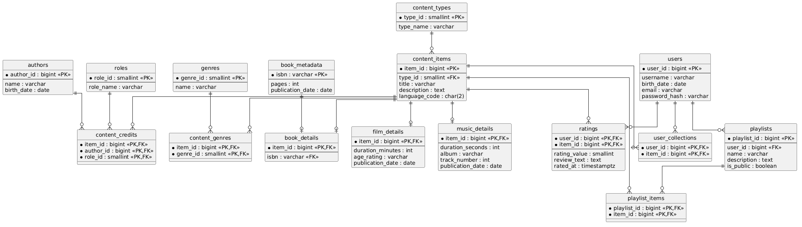

# Лабораторная работа 1. Проектирование реляционной модели данных

**Вариант:** Библиотека цифрового контента
Система для учета и каталогизации книг, фильмов и музыки. Пользователи могут 
добавлять items в свою личную коллекцию, создавать списки для чтения/прослушивания и 
ставить оценки.
Необходимо выделить 4+ сущностей и привести их в 3NF.
---

## Сущности и их назначение

### Пользователи

* **users** — хранит данные пользователей системы
  (логин, email, пароль, дата рождения)

---

### Контент

* **content_types** — справочник типов контента (книга, фильм, музыка)
* **content_items** — основной каталог контента

---

### Жанры

* **genres** — список жанров
* **content_genres** — связь контента с жанрами (M:N)

---

### Авторы и роли

* **authors** — информация о людях (авторы, режиссёры, исполнители)
* **roles** — типы ролей (например: автор, режиссёр, исполнитель)
* **content_credits** — связь контента с авторами и их ролями (M:N)

---

### Специфичные данные контента

#### Книги

* **book_metadata** — данные издания книги (ISBN, страницы, дата публикации)
* **book_details** — связь книги из каталога с конкретным ISBN

#### Фильмы

* **film_details** — длительность, возрастной рейтинг, дата публикации

#### Музыка

* **music_details** — длительность, альбом, номер трека, дата публикации

---

### Взаимодействие пользователей

* **user_collections** — личная коллекция пользователя (M:N)
* **playlists** — пользовательские списки контента
* **playlist_items** — элементы списков (M:N)
* **ratings** — оценки и отзывы пользователей

---

## Общая схема

